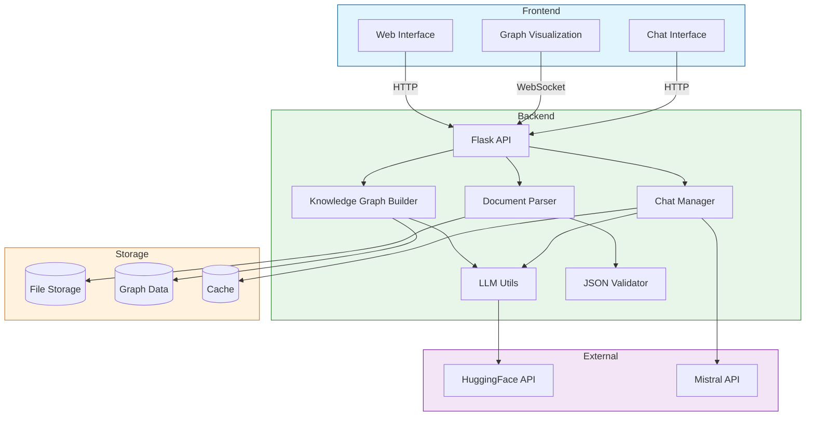

# Knowledge Graph Document Parser

This project provides utilities to parse various document formats and create an interactive knowledge graph with AI-powered chat capabilities.

## Prerequisites

- Python 3.8+
- Flask
- NumPy
- NetworkX
- PyYAML
- HuggingFace API token
- Mistral API access
- requests

## Installation

1. Clone the repository
2. Install dependencies:
```bash
pip install -r requirements.txt
```
3. Set up environment variables:
```bash
HUGGINGFACE_TOKEN=your_token_here
```

## Features

### Document Processing
- Supports multiple file formats:
  - PDF, DOC, DOCX, TXT, RTF
  - CSV, XLS, XLSX
  - Images (with OCR)
- Batch upload capability
- JSON output validation
- Progress tracking

### Knowledge Graph
- Interactive visualization
- Node and relationship management
- Graph statistics
- Custom graph queries
- Graph rebuilding
- Visual editor

### AI Features
- AI-powered chat interface
- Context-aware responses
- Knowledge graph integration
- JSON-structured outputs
- LLM response validation

## Capabilities

### Document Analysis
- Automated text extraction from multiple file formats
- Entity recognition and categorization
- Relationship extraction between concepts
- Confidence scoring for extracted information
- Contextual analysis of document content
- Batch processing of multiple documents
- Real-time processing progress tracking
- Image and Table Processing:
  - OCR for images and diagrams
  - Table structure recognition
  - Image metadata extraction
  - Image-text relationship mapping
  - Table header/content analysis
  - Image caption processing
  - Technical diagram interpretation
  - Format preservation in JSON output

### Knowledge Graph Management
- Dynamic graph construction and updates
- Node and edge weight calculations
- Multi-level relationship mapping
- Custom query support with context awareness
- Interactive graph visualization
- Visual graph editing capabilities
- Graph statistics and analytics
- Cache management for performance optimization
- Automatic graph rebuilding

### Accessing the Graph Editor
1. Navigate to `/graph/editor` in your web browser
2. Login with your credentials if required
3. The editor provides the following features:
   - Add/delete nodes with right-click menu
   - Create relationships by dragging between nodes
   - Edit node properties via the sidebar
   - Adjust layout with drag-and-drop
   - Save changes with the 'Apply' button
   - Undo/redo support for all operations

### Chat Intelligence
- Context-aware conversation handling
- Knowledge graph-based response generation
- Session management with timeouts
- Conversation history tracking
- Message caching for performance
- Automatic context retrieval
- Structured JSON response formatting
- Error handling and recovery
- Rate limiting and retry logic

### API Integration
- HuggingFace API integration for AI processing
- Mistral API integration for chat
- Websocket support for real-time updates
- RESTful API endpoints for all features
- Secure API authentication
- Rate limiting and connection pooling
- Automatic retry mechanisms
- Keep-alive connection management

### Data Management
- JSON validation and cleanup
- File upload and storage management
- Automatic file organization
- File format conversion
- Data integrity checks
- Security validation
- Export capabilities
- Backup management

### User Interface
- Drag-and-drop file upload
- Interactive graph visualization
- Real-time progress tracking
- File management interface
- Chat interface
- Graph editing tools
- Statistics dashboard
- Responsive design
- Dark/light theme support

## System Architecture



## API Documentation

### Document Endpoints
- `POST /upload` - Upload and process documents
- `GET /files` - List processed files
- `DELETE /files/<filename>` - Delete processed file

### Graph Endpoints
- `POST /graph/build` - Rebuild knowledge graph
- `GET /graph/view` - View interactive graph
- `GET /graph/stats` - Get graph statistics
- `POST /graph/query` - Query the graph

### Chat Endpoints
- `POST /chat/session` - Create chat session
- `POST /chat/message` - Send message
- `GET /chat` - Access chat interface

## Output Format

Documents are processed into JSON with the following structure:
```json
{
    "entities": [
        {
            "text": "string",
            "category": "string",
            "confidence": number
        }
    ],
    "relationships": [
        {
            "source": "string",
            "type": "string", 
            "target": "string",
            "weight": number
        }
    ],
    "media": {
        "images": [
            {
                "id": "string",
                "type": "image",
                "content": "base64_encoded_string",
                "metadata": {
                    "width": number,
                    "height": number,
                    "format": "string",
                    "caption": "string",
                    "extracted_text": "string",
                    "confidence": number
                },
                "relationships": [
                    {
                        "type": "illustrates",
                        "target": "entity_id",
                        "confidence": number
                    }
                ]
            }
        ],
        "tables": [
            {
                "id": "string",
                "type": "table",
                "headers": ["string"],
                "data": [["string"]],
                "metadata": {
                    "rows": number,
                    "columns": number,
                    "title": "string",
                    "caption": "string",
                    "confidence": number
                },
                "relationships": [
                    {
                        "type": "supports",
                        "target": "entity_id",
                        "confidence": number
                    }
                ]
            }
        ]
    }
}
```

### Media Processing Details

#### Image Processing
- OCR extraction with confidence scores
- Metadata preservation (dimensions, format)
- Caption and context linkage
- Technical diagram interpretation
- Automatic relationship mapping to relevant text entities

#### Table Processing  
- Structure preservation with headers/data
- Row/column metadata
- Caption and title extraction
- Data type inference
- Relationship mapping to supporting content
- Confidence scoring for extracted cells

## Troubleshooting

### Common Issues
1. Connection errors with HuggingFace API
   - Check API token is set correctly
   - Verify network connection
   - Check API rate limits

2. JSON format errors
   - Validate input file format
   - Check for encoding issues
   - Use built-in validation endpoint

3. Graph visualization issues
   - Clear browser cache
   - Check browser console for errors
   - Verify graph data integrity

4. Chat functionality issues
   - Verify Mistral API access
   - Check context length limits
   - Monitor response timeouts

## License

MIT License
